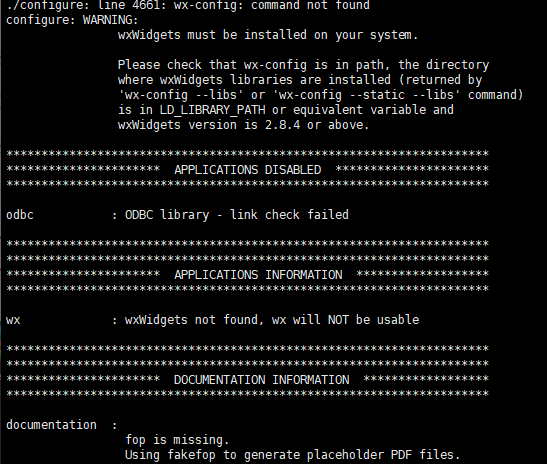
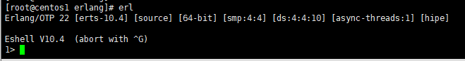
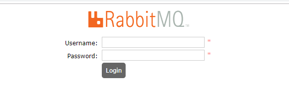
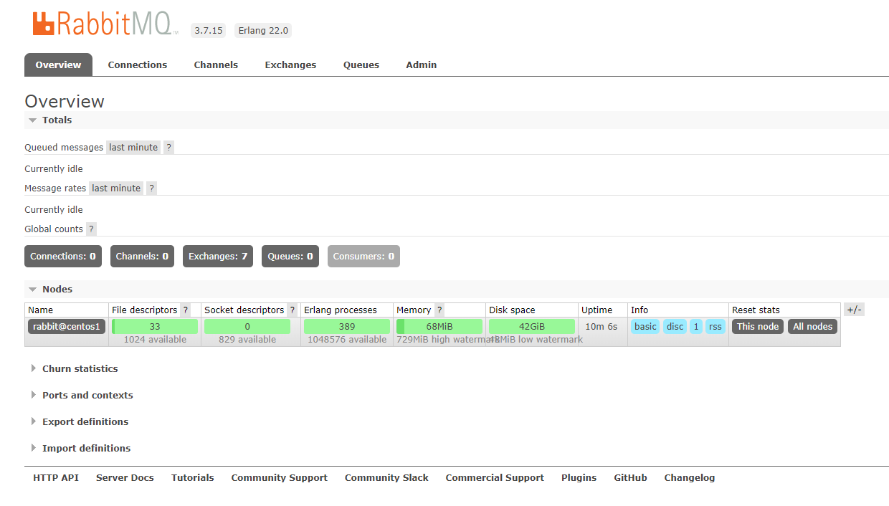
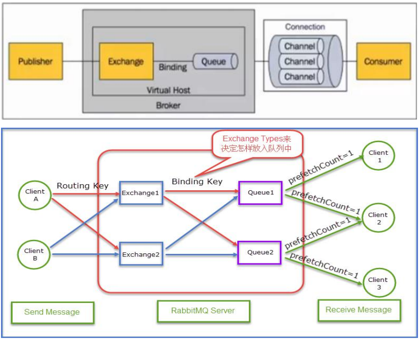

# CentOS7安装RabbitMQ

### 1、参考地址

[https://www.cnblogs.com/fengyumeng/p/11133924.html]()

### 2、环境检查

- 检查hostname

  命令行输入：hostname，查看当前服务器的hostname

  

  如上图，hostname为colin.com，而rabbit识别的hostname只是第一个"."之前的标识；所以要在hosts文件中添加colin标识：

  192.168.253.130为我的虚拟机ip地址

  vim /etc/hosts
  
  

### 3、安装erlang

#### 3.1、安装依赖

```java
yum -y install gcc glibc-devel make ncurses-devel openssl-devel xmlto perl wget gtk2-devel binutils-devel
```

[erlang官网](https://www.erlang.org/downloads)

#### 3.2、开始安装

- 下载（会比较慢，请耐心等待）

  ```java
  wget http://erlang.org/download/otp_src_22.0.tar.gz
  ```

- 解压

  ```java
  tar -zxvf otp_src_22.0.tar.gz
  ```

- 将解压出来的文件夹移动到安装目录

  ```java
  mv otp_src_22.0 /usr/local/
  ```

- 切换目录

  ```java
  cd /usr/local/otp_src_22.0/
  ```

- 创建即将安装的目录

  ```java
  mkdir ../erlang
  ```

- 配置安装路径

  ```java
  ./configure --prefix=/usr/local/erlang
  ```

  - 可能会看到如下错误，忽略继续

    

- 执行安装命令

  ```java
  make install
  ```

- 查看安装是否成功

  ```java
   /usr/local/erlang/bin
  ```

- 添加环境变量

  ```java
  echo 'export PATH=$PATH:/usr/local/erlang/bin' >> /etc/profile
  ```

- 刷新环境变量

  ```java
  source /etc/profile
  ```

- 验证是否安装成功

  

  - 输入halt().命令退出来（那个点号别忘记）

### 4、安装RabbitMQ

rabbitmq下载地址：

https://github.com/rabbitmq/rabbitmq-server/releases/tag/v3.7.15

- 下载

  ```java
  wget https://github.com/rabbitmq/rabbitmq-server/releases/download/v3.7.15/rabbitmq-server-generic-unix-3.7.15.tar.xz
  ```

- 由于是tar.xz格式的所以需要用到xz，没有的话就先安装 

  ```java
  yum install -y xz
  ```

- 第一次解压

  ```java
  /bin/xz -d rabbitmq-server-generic-unix-3.7.15.tar.xz
  ```

- 第二次解压

  ```java
  tar -xvf rabbitmq-server-generic-unix-3.7.15.tar
  ```

- 移走

  ```java
  mv rabbitmq_server-3.7.15/ /usr/local/
  ```

- 改名

  ```java
  mv /usr/local/rabbitmq_server-3.7.15  rabbitmq
  ```

- 配置环境变量

  ```java
  echo 'export PATH=$PATH:/usr/local/rabbitmq/sbin' >> /etc/profile
  ```

- 刷新环境变量

  ```java
  source /etc/profile
  ```

- 创建配置目录

  ```java
  mkdir /etc/rabbitmq
  ```

- 启动

  ```java
  rabbitmq-server -detached
  ```

- 停止

  ```java
  rabbitmqctl stop
  ```

- 查看状态

  ```java
  rabbitmqctl status
  ```

  防火墙之类的请自行处理（5672和15672端口），反正我是从来不开防火墙。

- 开启web插件

  ```java
  rabbitmq-plugins enable rabbitmq_management
  ```

- 访问web页面

  浏览器打开：http://127.0.0.1:15672/

  

  ### 

  ### 

### 5、用户管理

- 查看所有用户

  ```java
  rabbitmqctl list_users
  ```

- 添加一个用户

  ```java
  rabbitmqctl add_user sxf 123456
  ```

- 配置用户权限

  ```java
  rabbitmqctl set_permissions -p "/" sxf ".*" ".*" ".*"
  ```

- 查看用户权限

  ```java
  rabbitmqctl list_user_permissions sxf
  ```

- 设置tag

  ```java
  rabbitmqctl set_user_tags sxf administrator
  ```

- 安全起见，删除默认用户（可选，如果是开发环境建议保留）

  ```java
  rabbitmqctl delete_user guest
  ```

- 登录

  配置好用户之后重启一下rabbit

  然后就可以用新账号进行登陆

  

### 6、关键词说明

​		**原理图**



​		**关键词**

| 1. Message(消息)                                             |
| ------------------------------------------------------------ |
| 消息是不具名的,它由消息头消息体组成。消息体是不透明的,而消息头则由系列可选属性组成,这些属性包括: routing-key路由键)、 priority((相对于其他消息的优先权)、 delivery-mode(指出消息可能持久性存储)等。 |
| **2. Publisher(生产者)**                                     |
| 消息的生产者。也是一个向==交换器==发布消息的==客户端应用程序== 。 |
| **3. Consumer(消费者)**                                      |
| 消息的消费者。表示一个从==消息队列==中取得消息的==客户端应用程序==。 |
| **4. Exchange(交换器)**                                      |
| 交换器。用来接收生产者发送的消息并将这些消息==路由==给服务器中的队列。<br />三种常用的交换器类型<br />         1. direct(发布与订阅完全匹配)<br />         2. fanout(广播)<br />         3. topic(主题,规则匹配) |
| **5. Binding(绑定)**                                         |
| 用于消息队列和交换器之间的关联。一个绑定就是基于==路由键==将交换器和消息队列连接起来的路由规则,所以可以将交换器理解成一个由绑定构成的==路由表==。 |
| **6.Queue(队列)**                                            |
| 消息队列。用来保存消息直到发送给消费者。它是消息的==容器==,也是消息的==终点==。一个消息可投入一个或多个队列。消息一直在队列里面,等待消费者链接到这个队列将其取走。 |
| **7. Routing-key（路由键）**                                 |
| 路由键。RabbitMQ 决定消息该投递到哪个队列的==规则==。<br />队列通过路由键绑定到交换器。<br/>消息发送到 MQ 服务器时，消息将拥有一个路由键，即便是空的，RabbitMQ 也会将其和绑定使用的路由键进行匹配。<br/>如果相匹配，消息将会投递到该队列。如果不匹配，消息将会进入黑洞。 |
| **8. Connection（连接）**                                    |
| 链接。指 rabbit 服务器和服务建立的 TCP 链接。                |
| **9. Channel（信道）**                                       |
| 信道。<br/>1，Channel 中文叫做信道，是 TCP 里面的==虚拟链接==。例如：电缆相当于 TCP，信道是<br/>一个独立光纤束，一条 TCP 连接上创建多条信道是没有问题的。<br/>2，TCP 一旦打开，就会创建 AMQP 信道。<br/>3，无论是==发布消息、接收消息、订阅队列==，这些动作都是通过信道完成的。 |
| **10.Virtual Host（虚拟主机）**                              |
| 虚拟主机。表示一批交换器，消息队列和相关对象。虚拟主机是共享相同的身份认证 和加密环境的独立服务器域。==每个 vhost 本质上就是一个 mini 版的 RabbitMQ 服务器，拥有 自己的队列、交换器、绑定和权限机制==。vhost 是 AMQP 概念的基础，必须在链接时指定， RabbitMQ 默认的 vhost 是/ |
| **11.Borker**                                                |
| 表示消息队列服务器实体。                                     |
| **交换器和队列的关系**                                       |
| 交换器是通过==路由键==和队列绑定在一起的，如果消息拥有的路由键跟队列和交换器的<br/>路由键匹配，那么消息就会被路由到该绑定的队列中。<br/>也就是说，消息到队列的过程中，消息首先会经过交换器，接下来交换器在通过路由<br/>键匹配分发消息到具体的队列中。<br/>路由键可以理解为匹配的规则。 |
| **RabbitMQ 为什么需要信道？为什么不是 TCP 直接通信？**       |
| 1. TCP 的创建和销毁开销特别大。创建需要 ==3 次握手==，销毁需要 ==4 次分手==。<br/>2. 如果不用信道，那应用程序就会以 TCP 链接 Rabbit，高峰时每秒成千上万条链接<br/>会造成资源巨大的浪费，而且操作系统每秒处理 TCP 链接数也是有限制的，必定造成性能<br/>瓶颈。<br/>3. 信道的原理是==一条线程一条通道，多条线程多条通道同用一条 TCP 链接==。一条 TCP<br/>链接可以容纳无限的信道，即使每秒成千上万的请求也不会成为性能的瓶颈。 |

### 7、ACK 机制

- 1）什么是消息确认ACK?

  ​		如果在处理消息的过程中,消费者的服务器在处理消息时出现异常,那可能这条正在处理的消息就没有完成消息消费,数据就会丢失。为了确保数据不会丢失,RabbitMQ支持消息确认-ACK

- 2）ACK的消息确认机制

  ​		ACK机制是消费者从 RabbitMQ收到消息并处理完成后,反馈给 RabbitMQ,RabbitMQ收到反馈后才将此消息从队列中删除。

  - 如果一个消费者在处理消息出现了网络不稳定、服务器异常等现象,那么就不会有ACK反馈, Rabbi tMQ会认为这个消息没有正常消费,会将消息重新放入队列中。
  - 如果在集群的情况下: Rabbi tMQ会立即将这个消息推送给这个在线的其他消费者。这种机制保证了在消费者服务端故障的时候,不丢失任何消息和任务。
  - 消息永远不会从 Rabbi tMQ中删除:只有当消费者正确发送ACK反馈, Rabbi tMQ确认收到后,消息才会从 Rabbi tMQ服务器的数据中删除。
  - 消息的ACK确认机制默认是打开的。

- 3）ACK机制的开发注意事项

  ​		如果忘记了ACK,那么后果很严重。当 Consumer退出时,Message会一直重新分发。然后 Rabbi tMQ会占用越来越多的内存,由于 Rabbi tMQ会长时间运行,因此这个“内存泄漏”是致命的。